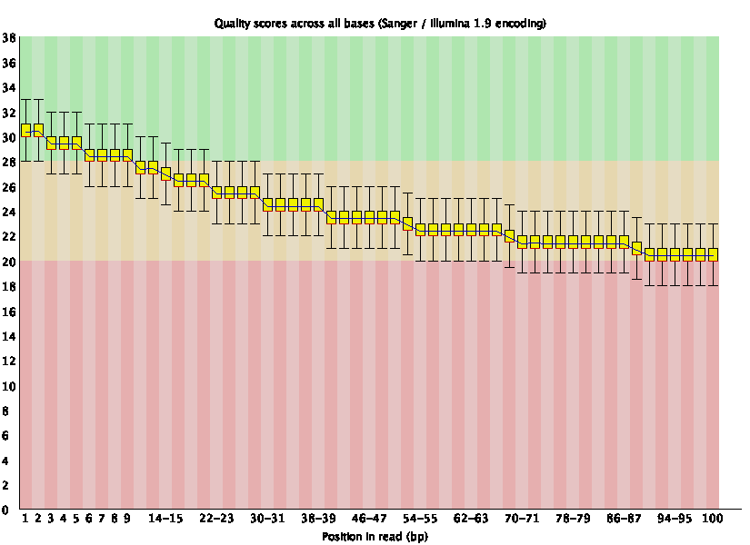
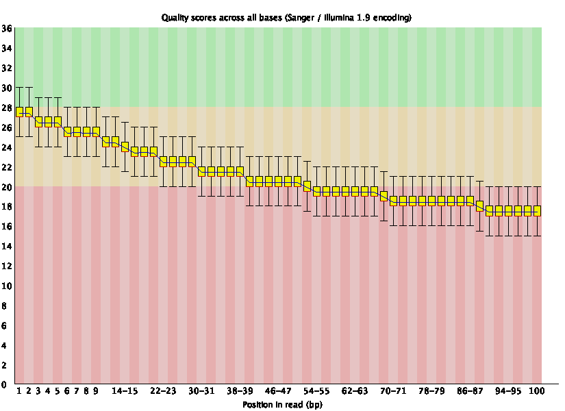
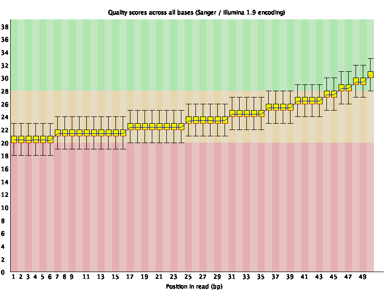
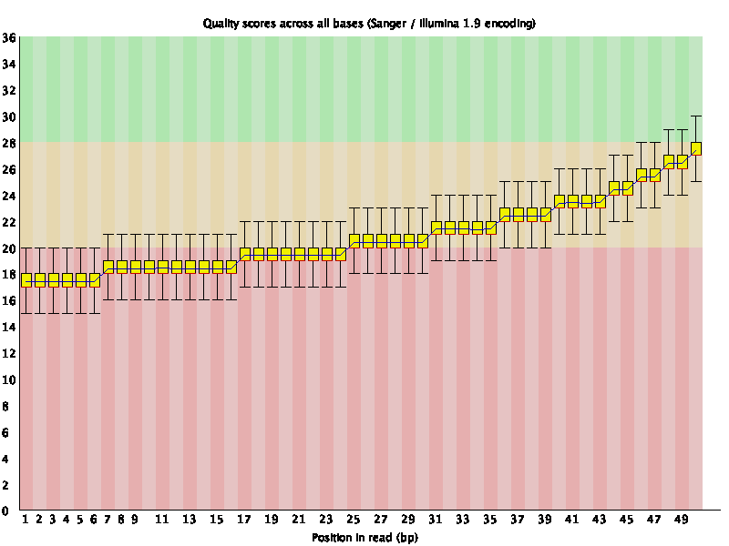

# Week 1 Assignments
### Zelin Wei
Setting working directory.

	cd qbb2020_answers/Week1/asm

## Question 1. Coverage analysis
### Q1a
	samtools faidx ref.fa
	head ref.fa.fai
Reference genome length is 233,806 bp.

### Q1b
	FastQC *.fq
For frag180 files, the read length is 100 bp and they each have 35,178 reads.

For jump2k files, the read length is 50 bp and they each have 70,355 reads.

### Q1c
	frag_len=100 jump_len=50 frag_c=35178 jump_c=70355 	ref_len=233806
	let cov=\(2\*$frag_len\*$frag_c+2\*$jump_len\*$jump_c\)\/$ref_len
	echo $cov
The coverage is about 60x.

### Q1d
Quality plot of frag180.1:

Quality plot of frag180.2:

Quality plot of jump2k.1:

Quality plot of jump2k.2:

## Question 2. Kmer analysis
### Q2a

	jellyfish count -m 21 -C -s 1000000 *.fq
	jellyfish histo *.jf > mer_counts.hist
	less mer_counts.hist
1091 21-mers have 50 counts.

### Q2b

	jellyfish dump -c -t mer_counts.jf | sort -k 2 -nr | head > Top10_21mers.txt
The outputs are:

|21-mer sequence|Count number|
|----|:----:|
|GCCCACTAATTAGTGGGCGCC|105|
|CGCCCACTAATTAGTGGGCGC|104|
|CCCACTAATTAGTGGGCGCCG|104|
|ACGGCGCCCACTAATTAGTGG|101|
|CAGGCCAGCTTATAAGCTGGC|98|
|AACAGGCCAGCTTATAAGCTG|98|
|ACAGGCCAGCTTATAAGCTGG|97|
|AGGCCAGCTTATAAGCTGGCC|95|
|AGCATCGCCCACATGTGGGCG|83|
|GCATCGCCCACATGTGGGCGA|82|

### Q2c
Upload the hist file to [GenomeScope](http://www.genomescope.org). Set kmer length to 21 and read length to 100 (although jump files only have a read length of 50 bp).

The [results](http://qb.cshl.edu/genomescope/analysis.php?code=ALOfmJMGxV74n9lusws7) show that the min genome haploid length is 233,468 bp.

### Q2d
GenomeScope estimated that the genome length is between 233,468 bp and 233,805 bp, very close to the actual length (233,806 bp), so it did very well.

## Question 3. *De novo* assembly
Assemble the genome using `spades`:

	spades.py --pe1-1 frag180.1.fq --pe1-2 frag180.2.fq --mp1-1 jump2k.1.fq --mp1-2 jump2k.2.fq -o assembled -t 4 -k 31
### Q3a
	grep -c '>' assembled/contigs.fasta
The line gives 4, meaning that we have 4 contigs.
### Q3b
	samtools faidx assembled/contigs.fasta
	head assembled/contigs.fasta.fai
The results are:

|Name|Length|Offset|Linebases|Linewidth|
|----|----|----|----|----|
|NODE_1_length_105831_cov_20.671371|105831 | 36   |   60   |   61|
|NODE_2_length_47861_cov_20.231319|47861 |  107666 | 60   |   61|
|NODE_3_length_41352_cov_20.588756    |   41352 |  156360 | 60   |   61|
|NODE_4_length_39423_cov_20.384723    |   39423 |  198437 | 60   |   61|

The column 'Length' corresponds to the length of the contigs.
### Q3c
	sort -k 2 -nr assembled/contigs.fasta.fai|head -1
This line gives that NODE\_1\_length\_105831\_cov\_20.671371 is the biggest contig with a length of 105,831 bp.
### Q3d
Write a python script [`GetN50.py`](GetN50.py), and run the following lines:

	sort -k 2 -nr asm/assembled/contigs.fasta.fai > sorted_contigs.fai
	python GetN50.py sorted_contigs.fai 233806
It gives that the N50 contig length is 47,861 bp.

## Question 4. Whole genome alignment
### Q4a
	dnadiff asm/ref.fa  asm/assembled/contigs.fasta
The average identify of my assembly compared to the ref genome is 100 %.
### Q4b
	nucmer -p nucmer asm/ref.fa  asm/assembled/contigs.fasta
	show-coords nucmer.delta
The outputs give that the longest alignment length is 105,831 bp.
### Q4c
	less out.report
The report gives that there is one 712-bp insertion in the query assembly, and five small insertions in the reference genome (that is 5 deletions in query assembly).

## Question 5. Decoding the insertion
Download the decoder script:

	wget https://raw.githubusercontent.com/bxlab/qbb2020/master/week1/ported_decoder.py
### Q5a
	show-coords out.delta
It gives that the insertion should be on NODE\_3\_length\_41352\_cov\_20.588756: 13,854...14,565 bp.
### Q5b
The insertion length in my assembly is 712 bp according to `less out.report` and `show-coords out.delta`.
### Q5c
Extract the insertion from my assembly:

	samtools faidx asm/assembled/contigs.fasta NODE_3_length_41352_cov_20.588756:13,854-14565 > Insertion_seq.fa
### Q5d
Run the following line:
	
	python ported_decoder.py --decode --rev_comp --input Insertion_seq.fa
And it gives:

Congratulations to the 2020 CMDB @ JHU class!  Keep on looking for little green aliens...

