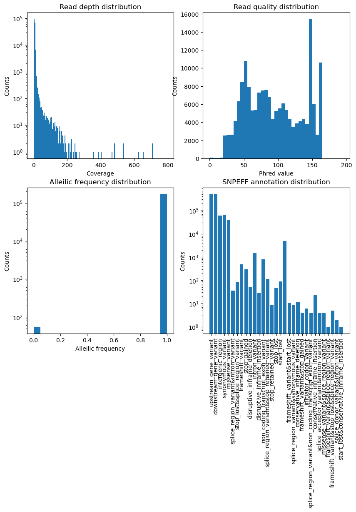

# Assignment 2: Variant Calling
#### Zelin Wei on 20 Sept.
## Getting softwares and raw data
Set up an conda environment:

	conda create -n lab-week2 python=3 snpeff=4.3 freebayes vcflib vcftools bwa samtools
	conda activate lab-week2

Download sequencing reads:

	wget "http://67.207.142.119/outgoing/BYxRM_subset.tar.xv"
	tar -xvzf BYxRM_subset.tar.xv
	
Download the reference genome:

	wget "http://hgdownload.soe.ucsc.edu/goldenPath/sacCer3/bigZips/chromFa.tar.gz"
	tar -xvzf chromFa.tar.gz
	cat chr*.fa > sacCer3.fa
	rm chr*.fa

## Index sacCer3 genome
Since sacCer3 genome is not too big, I choose IS algorithm here:

	bwa index -p idx -a is sacCer3.fa

## Align read files to the genome
I used a `for` loop here:

	for file in *.fastq
	do
		bwa mem -t 4 -R '@RG\tID:'$file'\tSM:'$file idx $file > ${file}.mem
	done
	
## Sort alignment files
I used a `for` loop here:

	for file in *.mem
	do
		samtools sort -o ${file}.bam -O BAM $file
	done

## Variant calling using `freebayes`
I used a `for` loop here:

	for file in *.bam
	do
		freebayes -p 1 --genotype-qualities -f sacCer3.fa $file > ${file}.vcf
	done
	
Since the yeast segregants are haploid ([Bloom, *et al*, 2013](https://www.nature.com/articles/nature11867)), I set the ploidy parameter `-p` to 1.

## VCF filtering

Phred value 20 corresponds to a 99% correction probability, so I select the alignments with "QUAL" greater than 20:

	for file in *.vcf
	do
		vcffilter -f "QUAL > 20" $file > ${file%%.*}.flted.vcf
	done

## Decompose complex haplotypes

Decompose multiple alleleic primitives in one VCF into multiple records:

	for file in *flted.vcf
	do
		vcfallelicprimitives -k -g $file > ${file%%.*}.dcp.vcf
	done
	
## Annotate predicted variant effect

Download `snpeff` genome:

	snpeff download R64-1-1.86
	
Annotate the decomposed VCF files with variant effect:

	for file in *dcp.vcf
	do
		snpeff R64-1-1.86 $file > ${file%%.*}.eff.vcf
	done
	
## Visualize annotated data by Python

A Python script [`SNPeff_plot.py`](SNPeff_plot.py) is written to plot read depth distribution, quality distribution, allele frequency spectrum, and predicted effect distribution for all yeast strains. This is achieved by running:

	python SNPeff_plot.py eff.vcf All_strains_plots
	
The plots are shown below:

## Submission

Extract the first 1000 lines from the annotated `vcf` files and save them under a new repository [`VCF`](VCF/):

	mkdir VCF
	for file in *eff.vcf
	do
		head -1000 $file > VCF/${file%%.*}.ann.vcf
	done
	
`git commit` all files needed for submission.

