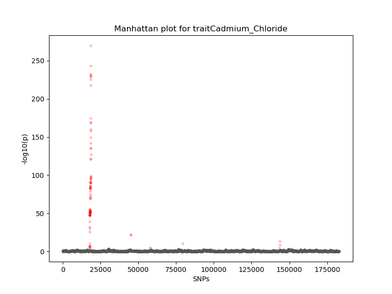

# Week 3 Assignments

#### Zelin Wei
27 Sept., 2020

## Obtaining data

Download the two files:

	wget http://67.207.142.119/outgoing/BYxRM_segs_saccer3.bam.simplified.vcf.xz
	wget http://67.207.142.119/outgoing/BYxRM_PhenoData.txt
	
Unzip the genotype file:

	unxz BYxRM_segs_saccer3.bam.simplified.vcf.xz
	
## PCA and allele frequency spectrum

Calculate counts for all SNPs:

	plink --vcf BYxRM_segs_saccer3.bam.simplified.vcf --allow-extra-chr --recodeA --out BYxRM_segs_saccer3.SNPcounts
	
Write a [`python` script](PCA_and_plotting.py) for PCA and plotting frequency spectrum:
	
	python PCA_and_plotting.py
	
The plot for PC1 and PC2 is shown below:

The allele frequency spectrum is:

## Quantitative association testing by `plink`

Modify the phenotype file for `plink`:

	header=`head -1 BYxRM_PhenoData.txt`
	sed 's/_/	/' BYxRM_PhenoData.txt > BYxRM_PhenoData_modified.txt
	sed -i '' '1d' BYxRM_PhenoData_modified.txt
	echo FID'\t'IID$header > Phenotypes.txt
	cat BYxRM_PhenoData_modified.txt >> Phenotypes.txt
	rm BYxRM_PhenoData_modified.txt
	
Run PCA by `plink`:

	 plink --vcf BYxRM_segs_saccer3.bam.simplified.vcf --pca --mind --allow-extra-chr
	 
Run quantitative association testing:

	plink --vcf BYxRM_segs_saccer3.bam.simplified.vcf --pheno Phenotypes.txt --all-pheno --linear --allow-no-sex --covar plink.eigenvec --covar-number 1-10 --allow-extra-chr
	mkdir assoc_linear
	mv *.assoc.linear assoc_linear
	
A [`python` script](Manhattan_and_QQ.py) is used for generating Manhattan plots and QQ plots for all the traits:

	mkdir Manhattan_and_QQ
	for file in `find assoc_linear/`
	do
		echo $file > temp
		out=`cut -d. -f2 temp`
		mkdir 'Manhattan_and_QQ/Trait_'$out'_Plots'
		python Manhattan_and_QQ.py $file 'Manhattan_and_QQ/Trait_'$out'_Plots'
	done
	rm temp
	
Take trait 'Cadmium_Chloride' as an example, the Manhattan plot is shown below:

And the QQ plot:

## Boxplots of traits stratified by highly-associated genotypes

Here I choose trait 'Cadmium_Chloride' as an example. Use the command below to identify top-associated SNP:

	grep 'ADD' assoc_linear/plink.Cadmium_Chloride.assoc.linear | grep -v 'NA' | sort -k9,9g | head -20
	
It gives that **chr II: 795756** has the smallest *p* value (*p* = 1.3e-270, beta = -5.762), so I focus on this site.

Use `plink` to extract SNPs on this site:

	plink --vcf BYxRM_segs_saccer3.bam.simplified.vcf --allow-extra-chr --chr chrII --from-bp 795756 --to-bp 795756 --recodeA --out ChrII795756
	
Write a [`python` script](boxplot_chrII795756.py) to generate the boxplots:

