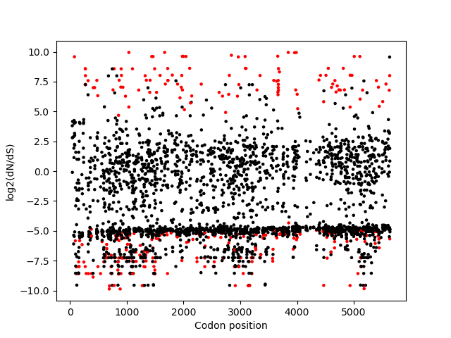

# Week 4 Assignments: Sequence Alignment and Evolution

**Zelin Wei**

6 Oct., 2020

## Download query sequence and install tools

Query sequence is downloaded and tools needed are  installed:

	conda install emboss mafft
	wget http://bxlab.github.io/cmdb-lab/data/week-4/week4_query.fa 

## BLAST by [NCBI BLAST Suite](https://blast.ncbi.nlm.nih.gov/Blast.cgi?PROGRAM=blastn&PAGE_TYPE=BlastSearch&BLAST_SPEC=&LINK_LOC=blasttab)

The screenshot is shown below:

In the **'Choose Search Set'** category, I chose **'Standard databases (nr etc.)'** for **'Database'**;

In the **'Program Selection'** category, I chose **'Somewhat similar sequences (blastn)'**;

Under the **'Algorithm parameters'**, I selected **1000** for **'Max target sequences'** and typed in **0.0001** for **'Expect threshold'**;

Other settings are default.

In the result page, I downloaded `FASTA` files for all aligned sequences and renamed it `seqaligned.txt`.

I combined the query sequence and the aligned sequence into a new file named `allseqs.fa`:

	touch allseqs.fa
	cat week4_query.fa >> allseqs.fa 
	cat seqaligned.txt >> allseqs.fa

## Multiple sequence alignment

Translate all DNA sequences into amino acids:

	transeq allseqs.fa allseqsTranslated.pep

Then align them using `MAFFT`:

	mafft allseqsTranslated.pep > allseqsTranslated.mafft

## Convert amino acids back to nucleotides

I write a `Python` script [`AAtoDNA.py`](AAtoDNA.py) for the conversion, where I borrowed the `FASTAReader` codes from the bootcamp:

	python AAtoDNA.py

## Looking for selection

Run the `Python` script [`ztest.py`](ztest.py) :

	python dNSratio.py

The z score for D (dN-dS) across all codons is -41.68, and the p value is very small. Therefore the null hypothesis should be rejected and dS is significantly more enriched than dN, indicating there is strong selection on this protein.

The plot of log2 dN/dS ratio is shown below:

The red dots represent codon with a p value less than 0.05.