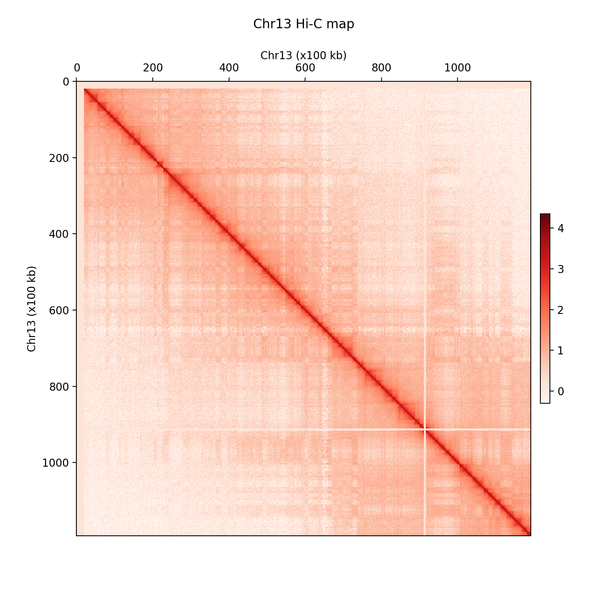
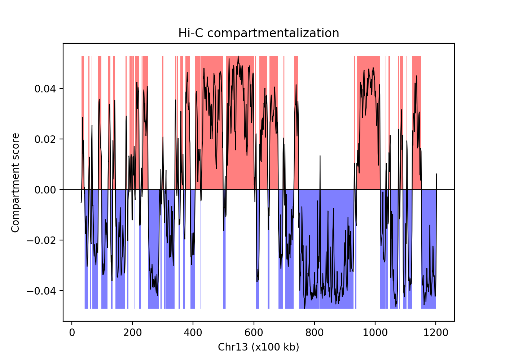
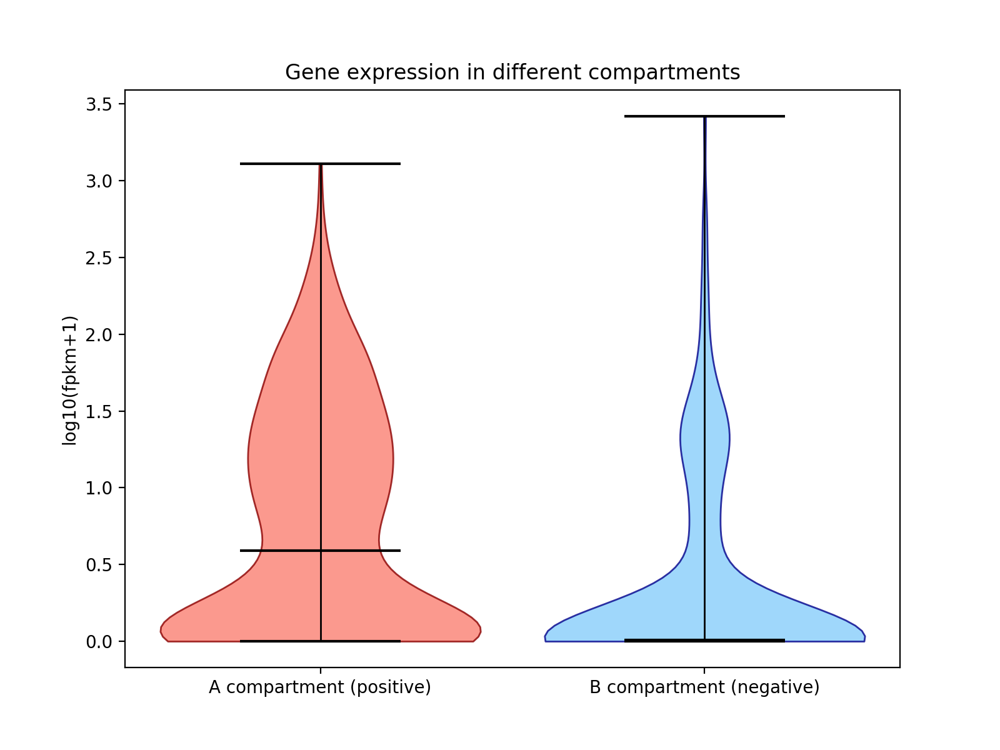
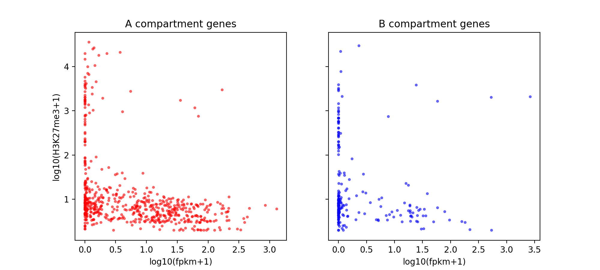

# Week 9 Assignment: 3D Genome

**Zelin Wei**

29 Nov., 2020

First build up the environment and download the data:

	conda create -n hifive hifive python=2 matplotlib bedtools pyBigWig
	conda activate hifive
	cd qbb2020_answers
	mkdir Week9
	cd Week9
	wget https://bx.bio.jhu.edu/data/cmdb-lab/3DGenomeData.tar.gz
	tar xzf 3DGenomeData.tar.gz
	
## Loading Hi-C data

First, generate a `Fend` object for Hi-C data:

	hifive fends -L genome/mm9.len  --binned 100000 -g mm9 mm9Fends.hdf5
	#'-L' indicates that the input file is a chromosome length file.
	#Use '--binned' to define bin length.

Then write the data into this `Fend` object:

	hifive hic-data -X data/WT_100kb/raw_\*.mat
	#'\*' indicates that a .txt based matrix is used.

Create a `hic-project` for subsequent data processing:

	hifive hic-project -f 25 -n 25 -j 100000 mm9HiC mm9HiCProject

Normalize the data:

	hifive hic-normalize express -f 25 -w cis mm9HiCProject

## Generate Hi-C heatmap

Use a `python` script [`HiCHeatmapChr13.py`](HiCHeatmapChr13.py) to generate the heatmap for Hi-C data on Chr13:

	python HiCHeatmapChr13.py

## Compartmentalization

Use a `python` script [`CompartmentalizationChr13.py`](CompartmentalizationChr13.py) to distinguish A- and B-compartments along Chr13:

	python CompartmentalizationChr13.py
	

Sort out regions with negative compartment scores:

	grep - hic_comp.bed > NegcompHic.bed
	
Then categorize genes into two compartments:

	bedtools intersect -wa -a data/WT_fpkm.bed -b NegcompHic.bed -f 0.5 >Negcompgenes.bed
	bedtools intersect -v -wa -a data/WT_fpkm.bed -b NegcompHic.bed -f 0.5 >Poscompgenes.bed
	
Use a `python` script [`CompGeneExp.py`](CompGeneExp.py) to generate violin plots:

	python CompGeneExp.py

## H3K27 methylation in different compartments

Use a `python` script [`CompH3K27me3.py`](CompH3K27me3.py) to generate H3K27me3 versus gene expression scatter plots:

	python CompH3K27me3.py

